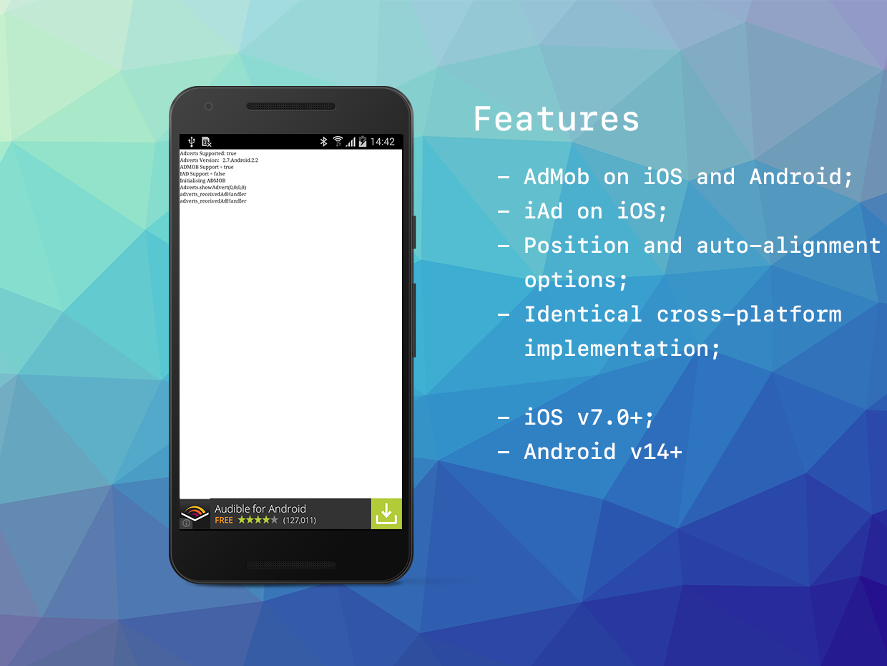

built by [distriqt //](https://airnativeextensions.com) 

# Adverts

The [Adverts](https://airnativeextensions.com/extension/com.distriqt.Adverts) extension 
gives you the ability to display adverts in your AIR application.

This extension allows you to monetise your application by displaying advertisements, including banners and interstitials.

Currently the extension supports the following advertising platforms:

- Google AdMob: Android, iOS
- Apple iAd: iOS

### Features

- Show/Hide adverts
- Identical cross-platform implementation
- Position and auto-alignment options
- iAd on iOS
- AdMob on both iOS and Android

As with all our extensions you get access to a year of support and updates as we are 
continually improving and updating the extensions for OS updates and feature requests.

## Documentation

Latest documentation can be found in the [wiki](https://github.com/distriqt/ANE-Adverts/wiki)

More information here: 

[com.distriqt.Adverts](https://airnativeextensions.com/extension/com.distriqt.Adverts)

## License

You can purchase a license for using this extension:

[airnativeextensions.com](https://airnativeextensions.com/)

distriqt retains all copyright.

