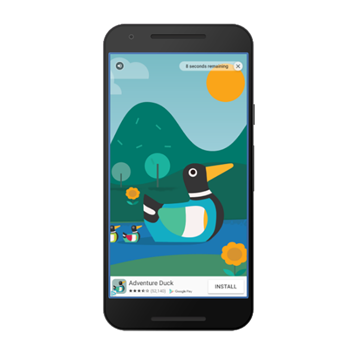

Rewarded video ads are full-screen video ads that users have the option of watching in full in exchange for in-app rewards.



Rewarded ads are click-to-download video ads with an end card that appears when the video ends.


Clicking on the X button will generate a prompt asking if the user wishes to close the ad.
The user is warned that they will lose the reward if the ad is closed.


Rewarded Video Ads are represented by the `RewardedVideoAd` class. There is only ever one instance of this class created which you get access to through the extension and then use this instance to set properties, load and display rewarded video ads.

All of the rewarded video ads functionality is provided through the `Adverts.service.rewardedVideoAds` singleton.

>
> You must initialise an advert platform before calling any of the rewarded video ad functionality. 
> See the  section.
>


## Support

The rewarded video ads have their own `isSupported` flag as rewarded video ads may not be available on all platform and services.

To check if rewarded video ads are supported:

```as3
if (Adverts.service.rewardedVideoAds.isSupported)
{
	// rewarded video ads are supported
}
```

This allows you to create a fallback scenario if rewarded video ads aren't supported on the current platform and device. 


## `RewardedVideoAd`

To get access to the `RewardedVideoAd` instance use the `createRewardedVideoAd()` function:

```as3
var rewardedVideoAd : RewardedVideoAd = Adverts.service.rewardedVideoAds.createRewardedVideoAd();
```

This will instanciate a single instance of the `RewardedVideoAd` class until it is destroyed at which point another would be created by this function.


## Loading

Rewarded Video Ads should be preloaded in your application. This allows you to start the load at any time, and only display when your application is ready and when the advert has been loaded. You cannot display a rewarded video ad until it is loaded and ready.

To load an advert you use the `load` function and pass it the `adUnitId` to load along with an `AdRequest` object which will specify the details of the ad request to load.

The simplest example is to just use a generic request:

```as3
rewardedVideoAd.load( "REWARDED_AD_UNIT_ID", new AdRequestBuilder().build() );
```

See  for more on the `AdRequestBuilder` targetting options.

You can listen for events that will inform you on when an advert is available or if there were any errors in loading the advert.

- `RewardedVideoAdEvent.LOADED`: dispatched when an ad has finished loading;
- `RewardedVideoAdEvent.ERROR`: dispatched if the ad failed to load


```as3
rewardedVideoAd.addEventListener( RewardedVideoAdEvent.LOADED, loadedHandler );
rewardedVideoAd.addEventListener( RewardedVideoAdEvent.ERROR, errorHandler );

function loadedHandler( event:RewardedVideoAdEvent ):void
{
	// rewarded video ad loaded and ready to be displayed
}

function errorHandler( event:RewardedVideoAdEvent ):void
{
	// Load error occurred. The errorCode will contain more information
	trace( "Error" + event.errorCode );
}
```

If an error occurs you can use the `errorCode` on the event to determine what type of error occurred. See the  guide to determine what happened.


## Testing and Development

It is very important that while you are developing your application that you do not serve live ads. **This is a requirement of the usage of AdMob and not following this correctly can have your application id blocked from using AdMob.**

While in development you should either use the test ad unit ids available or specify your test device id in your ad requests. More information on this is located in the section on 

The following Ad Unit IDs can be used to test rewarded video ads in your application:

- Android: `ca-app-pub-3940256099942544/5224354917`
- iOS: `ca-app-pub-3940256099942544/1712485313`		


## Checking Loaded

You can check whether the advert is loaded by waiting for the `RewardedVideoAdEvent.LOADED` 
or checking the `isLoaded()` flag. It is useful to use the flag to confirm that the ad is loaded before attempting to display the ad:

```as3
if (rewardedVideoAd.isLoaded())
{
	// Show the ad
}
```


## Display 

When you are ready to display the rewarded video you call `show()` as below:

```as3
rewardedVideoAd.show();
```

You should check whether the ad is loaded before calling show to ensure that there is an ad available to display (as noted above). If there isn't this call will fail and return `false`.

```as3
if (rewardedVideoAd.isLoaded())
{
	rewardedVideoAd.show();
}
```


## Events

There are several events dispatched by the rewarded video ad as the user interacts with it (in addition to the loaded and error events already mentioned):

- `RewardedVideoAdEvent.OPENED`: dispatched when an ad opens an overlay that covers the screen;
- `RewardedVideoAdEvent.VIDEO_STARTED`: dispatched when the video playback starts in the rewarded video ad;
- `RewardedVideoAdEvent.LEFT_APPLICATION`: when a user click opens another app (such as Google Play), backgrounding the current app;
- `RewardedVideoAdEvent.CLOSED`: dispatched when a user returns to the app, having closed the rewarded video ad;
- `RewardedVideoAdEvent.REWARD`: See the 


```as3
rewardedVideoAd.addEventListener( RewardedVideoAdEvent.OPENED, openedHandler );
rewardedVideoAd.addEventListener( RewardedVideoAdEvent.VIDEO_STARTED, videoStartedHandler );
rewardedVideoAd.addEventListener( RewardedVideoAdEvent.LEFT_APPLICATION, leftApplicationHandler );
rewardedVideoAd.addEventListener( RewardedVideoAdEvent.CLOSED, closedHandler );

function openedHandler( event:RewardedVideoAdEvent ):void 
{
    // The rewarded video ad has been opened and is now visible to the user 
}

function videoStartedHandler( event:RewardedVideoAdEvent ):void 
{
    // Video playback has started
}

function leftApplicationHandler( event:RewardedVideoAdEvent ):void 
{
    // Control has left your application, 
	// you can deactivate any none important parts of your application
}

function closedHandler( event:RewardedVideoAdEvent ):void 
{
	// Control has returned to your application
	// you should reactivate any paused / stopped parts of your application.
}
```


## Rewards

Rewarding your user should take place after the `RewardedVideoAdEvent.REWARD` event is dispatched.
This is the important event that is dispatched after the user has finished watching the video ad and is when you should give the reward associated with this event to your user.

```as3
rewardedVideoAd.addEventListener( RewardedVideoAdEvent.REWARD, rewardHandler );

function rewardHandler( event:RewardedVideoAdEvent ):void 
{
    // Here you should reward your user

    //     event.rewardAmount contains the amount that should be awarded to your user
    //     event.rewardType contains the type of this reward
}
```


## Refresh

Once you have displayed a rewarded video ad a new ad needs to be loaded in order to display the rewarded video ad again. This is a simple matter of starting a new ad request load:

```as3
rewardedVideoAd.load( "REWARDED_AD_UNIT_ID", new AdRequestBuilder().build() );
```

The `CLOSED` event is generally a good place to trigger this load so that you ensure you always have a loaded ad available to display in your application, however you can handle this process as you see fit.

